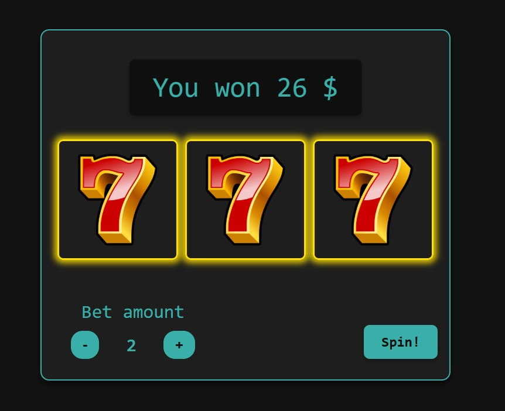

# Simple Slots Game

## Overview
This is a simple slots game built using pure HTML, CSS, and JavaScript. It's a fun and easy-to-play game where you can try your luck with a simple slot machine!

## Game Information
- **Starting Money**: $100
- **Bet Range**: $1 to $500
- **Winning Multiplier**: 13x your bet
- **Objective**: Spin the slots and match the symbols to win. If you run out of money, simply refresh the page to start over.

## How to Play
1. Set your bet amount between $1 and $500.
2. Click "Spin" to start the game.
3. If the symbols match, you'll win 13x your bet.
4. If you run out of money, refresh the page to start again with $100.

## Screenshot

## Demo
You can try out the game online here: [Online Demo Link]([http://your-demo-link.com](https://sikec.cz/jakubsdf/slots/))

---

Enjoy the game, and may luck be on your side!
